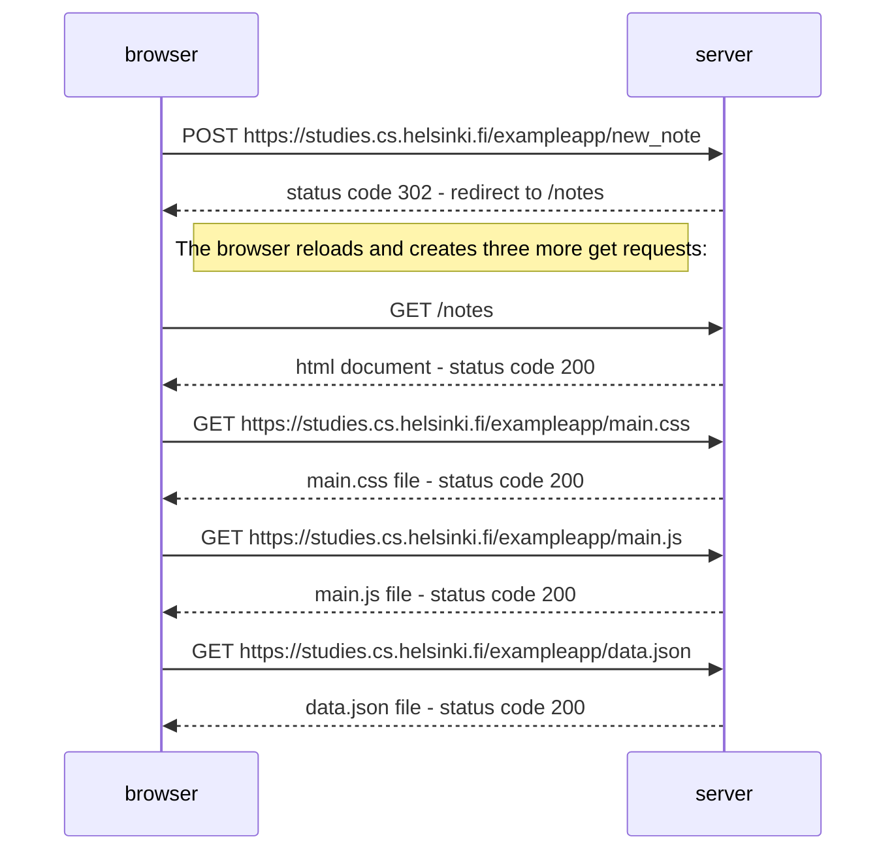

```mermaid
sequenceDiagram
    participant browser
    participant server

    browser->>server: POST https://studies.cs.helsinki.fi/exampleapp/new_note

    server-->>browser: status code 302 - redirect to /notes

    Note right of browser: The browser reloads and creates three more get requests:

    browser->>server: GET /notes
    server-->>browser: html document - status code 200

    browser->>server: GET https://studies.cs.helsinki.fi/exampleapp/main.css
    server-->>browser: main.css file - status code 200

    browser->>server: GET https://studies.cs.helsinki.fi/exampleapp/main.js
    server-->>browser: main.js file - status code 200

    browser->>server: GET https://studies.cs.helsinki.fi/exampleapp/data.json
    server-->>browser: data.json file - status code 200
```
